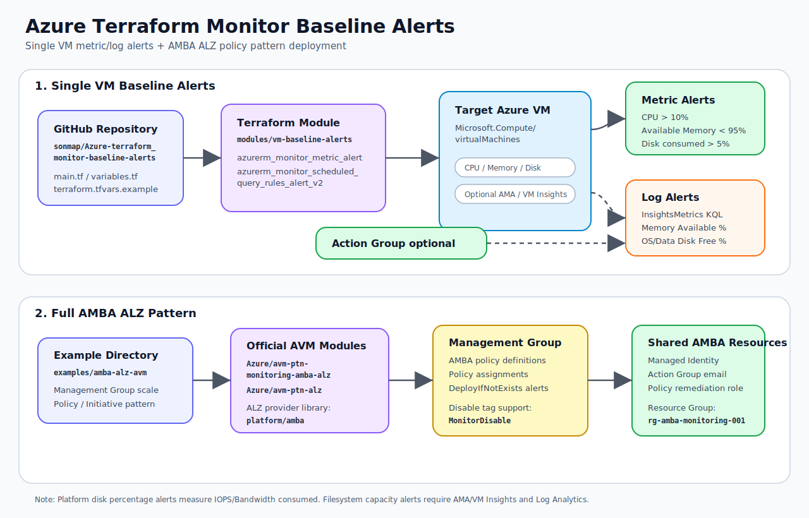

# Azure Terraform Monitor Baseline Alerts

Terraform conversion/starter repository for Azure Monitor Baseline Alerts (AMBA) style alerting.

## Architecture Diagram



This diagram shows two deployment paths:

- **Single VM baseline alerts**: deploys direct Azure Monitor metric alerts and optional VM Insights log alerts for one VM.
- **Full AMBA ALZ pattern**: deploys AMBA-style policy definitions, assignments, managed identity, and action group resources at management-group scale through the official Azure Verified Modules.

This repository has two practical layers:

1. **Single VM baseline alerts** using native Terraform resources:
   - CPU `Percentage CPU > 10`
   - Memory used percentage `> 5` using either platform `Available Memory Bytes` calculation or VM Insights log query
   - Disk consumed percentage `> 5` using Azure VM platform disk consumed metrics
   - Optional OS/Data disk filesystem free-space log alerts using VM Insights `InsightsMetrics`

2. **AMBA ALZ wrapper example** using Microsoft Azure Verified Module:
   - `Azure/avm-ptn-monitoring-amba-alz/azurerm`
   - This is the recommended path when deploying the full AMBA policy/initiative pattern at management-group scale.

> Source basis: Azure Monitor Baseline Alerts (AMBA) provides alert best-practice guidance by Azure service and ALZ scenario. The VM alert defaults in this repo are aligned with the AMBA VM alert catalog, then adjusted for the requested low thresholds.

## Repository layout

```text
.
├── main.tf
├── variables.tf
├── outputs.tf
├── versions.tf
├── terraform.tfvars.example
├── docs/
│   └── architecture.svg
├── modules/
│   └── vm-baseline-alerts/
│       ├── main.tf
│       ├── variables.tf
│       └── outputs.tf
└── examples/
    ├── single-vm/
    │   ├── main.tf
    │   ├── variables.tf
    │   └── terraform.tfvars.example
    └── amba-alz-avm/
        ├── main.tf
        ├── variables.tf
        └── terraform.tfvars.example
```

## Quick start: one VM

```bash
az login
az account set --subscription "<subscription-id>"

cp terraform.tfvars.example terraform.tfvars
vi terraform.tfvars

terraform init
terraform plan
terraform apply
```

Example `terraform.tfvars`:

```hcl
location                  = "koreacentral"
alert_resource_group_name = "rg-monitoring"
vm_resource_id            = "/subscriptions/<sub-id>/resourceGroups/<rg>/providers/Microsoft.Compute/virtualMachines/<vm-name>"
vm_name                   = "vm-test01"

cpu_threshold_percent           = 10
memory_used_threshold_percent   = 5
disk_consumed_threshold_percent = 5

# Required for platform memory alert calculation.
# Example: Standard_D2s_v3 has 8192 MB.
total_memory_mb = 8192

# Optional. Attach Action Group IDs if you already have them.
action_group_ids = []
```

## Important metric notes

### CPU

Uses Azure VM platform metric:

```text
Metric Namespace: Microsoft.Compute/virtualMachines
Metric Name     : Percentage CPU
Condition       : Average > 10
```

### Memory

Azure platform metric commonly exposes `Available Memory Bytes`, not direct memory-used percentage. Therefore:

```text
Used > 5%  ==  Available < 95%
```

For more accurate OS memory percentage, enable Azure Monitor Agent / VM Insights and use the included scheduled query alert.

### Disk

Azure VM platform disk percentage metrics are performance-consumption metrics, not filesystem capacity metrics.

This repo creates platform alerts for:

```text
OS Disk IOPS Consumed Percentage
OS Disk Bandwidth Consumed Percentage
Data Disk IOPS Consumed Percentage
Data Disk Bandwidth Consumed Percentage
```

For filesystem capacity such as `/`, `/var`, or `C:` usage, enable Azure Monitor Agent / VM Insights and use the included log query alerts based on:

```kusto
InsightsMetrics
| where Origin == "vm.azm.ms"
| where Namespace == "LogicalDisk" and Name == "FreeSpacePercentage"
```

## Enable VM Insights log alerts

Set:

```hcl
enable_vm_insights_log_alerts = true
log_analytics_workspace_id    = "/subscriptions/<sub-id>/resourceGroups/<rg>/providers/Microsoft.OperationalInsights/workspaces/<law-name>"
```

The module includes KQL queries for:

- Memory available percentage
- OS disk free space percentage
- Data disk free space percentage

## Full AMBA ALZ deployment

For full AMBA/ALZ management-group deployment, see:

```text
examples/amba-alz-avm/
```

That example wraps the official Azure AVM AMBA ALZ module rather than manually copying every generated policy JSON.

## Validate

```bash
terraform fmt -recursive
terraform init -backend=false
terraform validate
```

## License / source note

This repository is a Terraform starter/conversion based on the public AMBA design. Keep the original Microsoft license and attribution requirements in mind if you copy large portions of AMBA source files directly.
